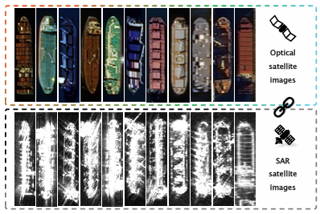
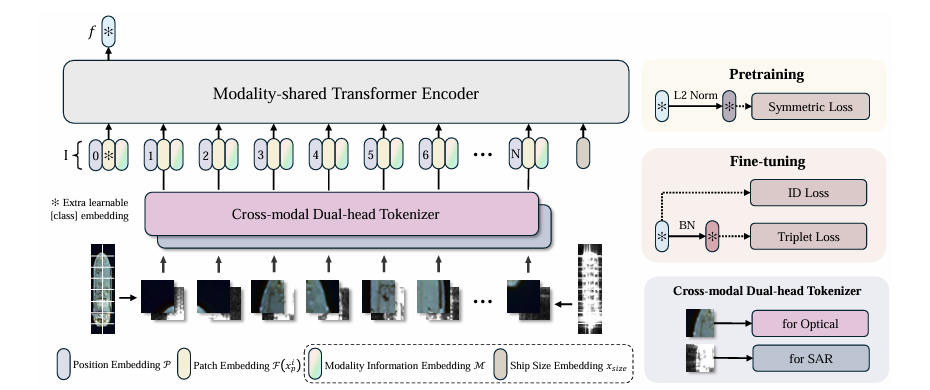

#  Cross-modal Ship Re-identification via Optical and SAR Imagery: A Novel Dataset and Method

### [**📝Paper**](https://arxiv.org/abs/2506.22027) | [**🗃️Dataset**](https://zenodo.org/records/15751352) | [**🤖Models**]()
The official repository for HOSS ReID Dataset and TransOSS.

## Abstract
>Detecting and tracking ground objects using earth observation imagery remains a significant challenge in the field of remote sensing.
Continuous maritime ship tracking is crucial for applications such as maritime search and rescue, law enforcement, and shipping analysis.
However, most current ship tracking methods rely on geostationary satellites or video satellites.
The former offer low resolution and are susceptible to weather conditions, while the latter have short filming durations and limited coverage areas, making them less suitable for the real-world requirements of ship tracking.
To address these limitations, we present the Hybrid Optical and Synthetic Aperture Radar (SAR) Ship Re-Identification Dataset (HOSS ReID dataset), designed to evaluate the effectiveness of ship tracking using low-Earth orbit constellations of optical and SAR sensors.
This approach ensures shorter re-imaging cycles and enables all-weather tracking.
HOSS ReID dataset includes images of the same ship captured over extended periods under diverse conditions, using different satellites of different modalities at varying times and angles.
Furthermore, we propose a baseline method for cross-modal ship re-identification, TransOSS, which is built on the Vision Transformer architecture.
It refines the patch embedding structure to better accommodate cross-modal tasks, incorporates additional embeddings to introduce more reference information, and employs contrastive learning to pre-train on large-scale optical-SAR image pairs, ensuring the model's ability to extract modality-invariant features.

## HOSS ReID Dataset
The dataset is publicly available at [zenodo](https://zenodo.org/records/15751352). \
If you want to run TransOSS, place the dataset in the `data` directory like:
```
data
└── HOSS
    └── bounding_box_test ..
```



## Pipeline



## Requirements

### Installation
The Python version we use is 3.9, and the PyTorch version is 2.2.2. It is recommended not to use versions lower than these.

```bash
pip install -r requirements.txt
```

## Training
### Pretraining
We utilize 4 GPUs for pretraining
```bash
CUDA_VISIBLE_DEVICES=0,1,2,3 python -m torch.distributed.launch --nproc_per_node=4 --master_port 6667 train_pair.py --config_file configs/pretrian_transoss.yml MODEL.DIST_TRAIN True
```
### Fine-tune
Single GPU fine-tuning
```bash
python train.py --config_file configs/hoss_transoss.yml
```
Multiple GPUs fine-tuning
```bash
CUDA_VISIBLE_DEVICES=0,1 python -m torch.distributed.launch --nproc_per_node=2 --master_port 6667 train.py --config_file configs/hoss_transoss.yml MODEL.DIST_TRAIN True
```
## Evaluation
```bash
python test.py --config_file configs/hoss_transoss.yml MODEL.DEVICE_ID "('0')"  TEST.WEIGHT 'weights/HOSS_TransOSS.pth'
```

## Citation
```
@misc{wang2025crossmodal,
      title={Cross-modal Ship Re-Identification via Optical and SAR Imagery: A Novel Dataset and Method}, 
      author={Han Wang and Shengyang Li and Jian Yang and Yuxuan Liu and Yixuan Lv and Zhuang Zhou},
      year={2025},
      eprint={2506.22027},
      archivePrefix={arXiv},
      primaryClass={cs.CV},
      url={https://arxiv.org/abs/2506.22027}, 
}
```

## Acknowledgement
Codebase from [TransReID](https://github.com/damo-cv/TransReID/tree/main), [reid-strong-baseline](https://github.com/michuanhaohao/reid-strong-baseline) , [pytorch-image-models](https://github.com/rwightman/pytorch-image-models).